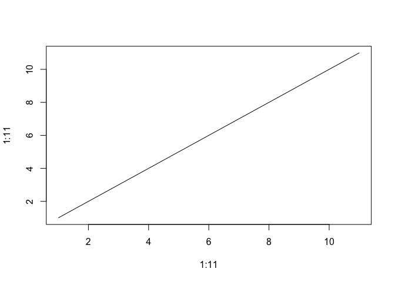

My First Markdown
================
Ueli Schmid
5/4/2021

## Let’s go\!\!

let’s try to do this in a separate branch

this time, i’ll use *secondbranch*

``` r
plot(1:13, 1:13, type = "l")
```

<!-- -->
